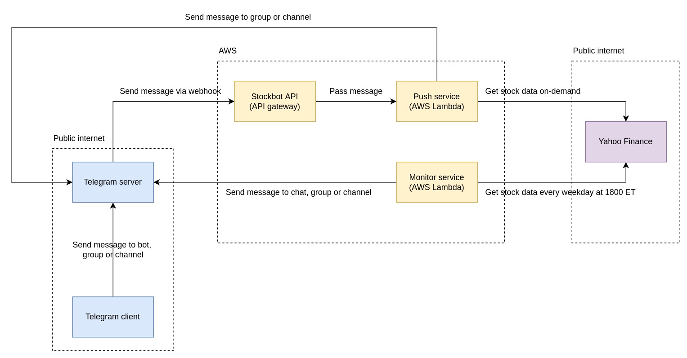

# Stockbot


[](https://github.com/julianespinel/stockbot/actions/workflows/makefile.yml)

This repository contains the code of a Telegram bot that gets information about stocks.

The bot supports the following commands:

1. `/start` - show the description of what the bot can do
2. `/help` - show the list of commands the bot support
3. `/price {symbol}` - get price stats
4. `/return {symbol}` - get return stats
5. `/vol {symbol}` - get volatility stats
6. `/all {symbol}` - get price, return, and volatility stats

In addition to the commands, the bot also monitors a given set of symbols
and sends alerts when a new minimum or maximum price is reached in any of
the symbols.

This is the high level design of Stockbot:



## Install

1. `virtualenv venv`
2. `source venv/bin/activate`
3. `make install`
4. `make build`

## Test

To execute the unit tests please run the following command: `make test`

### Coverage

To see the code coverage report please execute the following commands:

1. `make coverage`
3. `open htmlcov/index.html`

## Run

First define the required environment variables:

1. `export TELEGRAM_BOT_TOKEN='<bot-token-here>'`
2. `export CHANNEL_ID='<channel-id-here>'`
3. `export SYMBOLS='<symbol1>,<symbol2>,...,<symbolN>'`

Please enter symbols that are valid in [Yahoo Finance](https://finance.yahoo.com).

### Run locally

We can run the bot in two modes locally:
1. Polling mode: `make poll`
2. Monitor mode: `make monitor`

## Maintenance

The project has three directories at the root level:

1. `docs`: contains files related to documentation.
2. `infra`: contains CDK files that define the infrastructure.
3. `src`: contains the source code and tests of the bot.

### Source code

The code is organized in the following way:

1. We have components, each component has a single responsibility.
2. Each component has its own folder.
3. The folder of each component has its source code and tests.

We have the following components:

1. `analyst`: it is responsible for performing the analysis over the data.
2. `bot`: it is responsible for receive commands and return answers.
3. `common`: it is responsible to hold common types and data structures.
4. `download`: it is responsible for downloading the data we need to analyst.

In addition to the components we have 4 files in the root of the project:

1. `commands`: contains the commands supported by the bot.
2. `monitor`: lambda to monitor a list of symbols.
3. `poll`: code to get new messages via polling (polling Telegram).
4. `push`: lambda to get new messages via push (webhooks sent by Telegram).

### Project structure

To visualize the project structure, please execute the following command:

```bash
tree -I 'venv|__pycache__|test_files|htmlcov|cdk.out'
```

## Deploy

We use AWS CDK (infrastructure as code) + AWS API Gateway + AWS Lambda to deploy
the bot. The details are documented [here](infra/README.md).

Run the following command to create the infrastructure and deploy the code:
```bash
make deploy
```

If we want to delete the infrastructure created, please run this command:
```bash
make destroy
```
